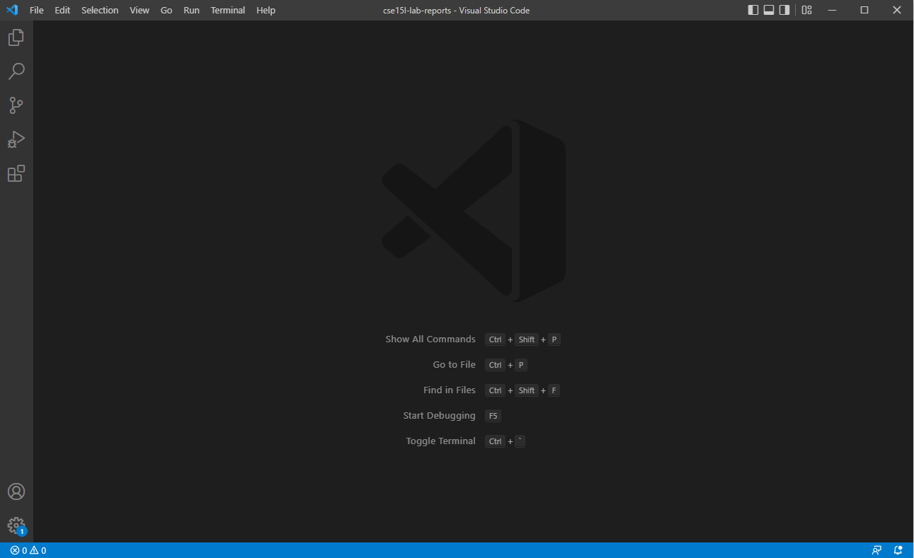
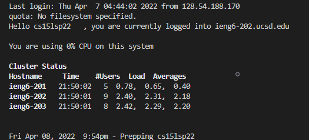
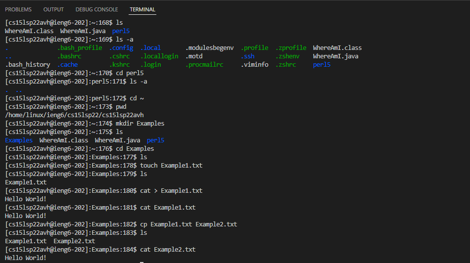
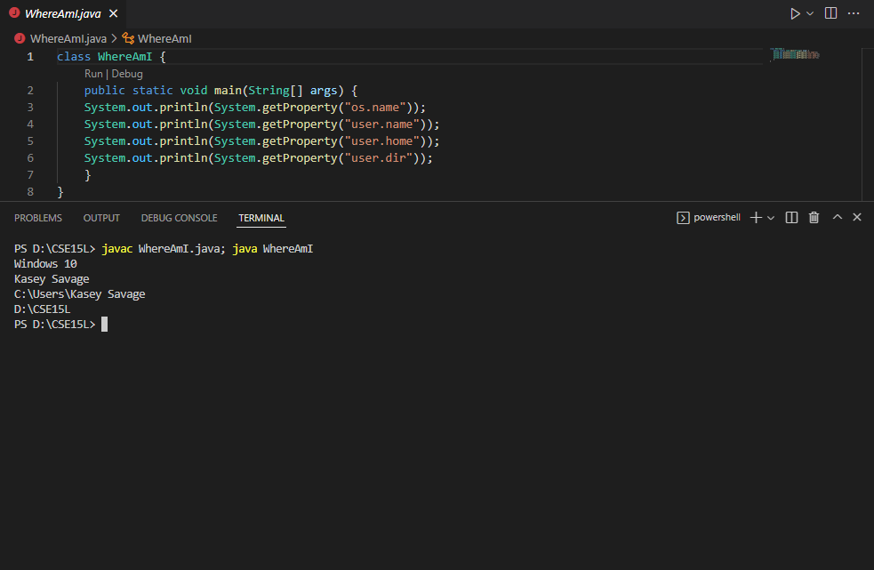
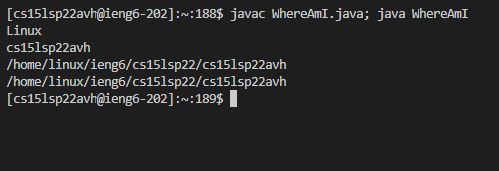
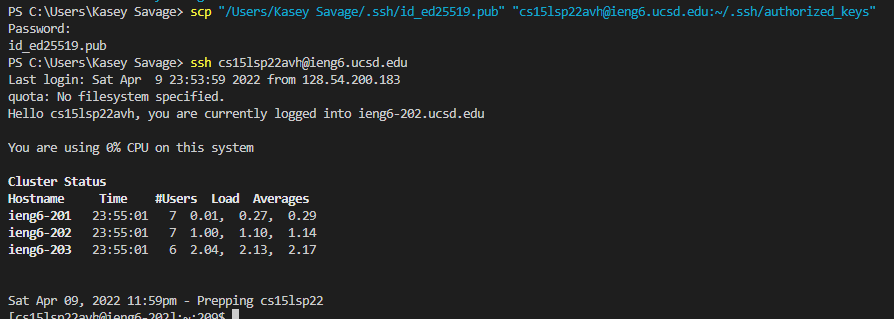
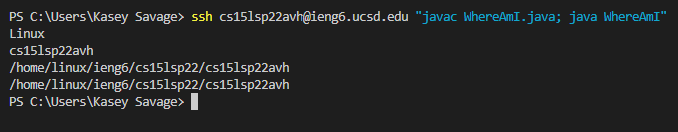

# Remote Access From Your Computer to ieng6

## **Step 1) Installing Visual Studio Code**


Go to the [Visual Studio Code website](https://code.visualstudio.com/) and install Visual Studio Code for your operating system. Follow what the site and installer tell you to do. 

Once it is setup open up Visual Studio Code and your screen should look like this. 



## **Step 2) Connecting Remotely**


Before going any further if you are on a Windows device you will need to install [OpenSSH](https://docs.microsoft.com/en-us/windows-server/administration/openssh/openssh_install_firstuse).

Now for everyone, go find your [CSE15L course specific account](https://sdacs.ucsd.edu/~icc/index.php).

Look for the account that is in the form of **cs15lsp22zzz** (The z is an actual letter but varies from account to account).

Now you will go to Visual Studio Code and open up a new terminal by clicking on ```Terminal``` and then on ```New Terminal```.

Now you will type ```ssh cs15lsp22zzz@ieng6.ucsd.edu``` (using your course specific account instead of the zzz). A message will then pop up.

> Are you sure you want to continue connecting (yes/no)? 

Type yes and then you will be prompted to type your password. Do so and your terminal should look something like this. 



## **Step 3) Running Some Commands**

Here are some commands that you can try running in the terminal. 

- ls

- ls -a

- cd

- pwd

- mkdir

- touch

- cat 

- cp

- exit

Here are some examples of how to call these commands and what the output should look like!


## **Step 4) Moving Files With `scp`**
Now we will be copying some files from our computer to ieng6. You can do this with many files on your computer, but for this we will be using a basic example just to show you how it works. 


First of all you can copy this code bellow, put it into a directory of your choice, and then run it using `javac WhereAmI.java; java WhereAmI`
```
class WhereAmI {
    public static void main(String[] args) {
        System.out.println(System.getProperty("os.name"));
        System.out.println(System.getProperty("user.name"));
        System.out.println(System.getProperty("user.home"));
        System.out.println(System.getProperty("user.dir"));
    }
}
```
Once done you should have something that looks like this. 


Now, in the same terminal you just ran that code, you will type the following:
```
scp WhereAmI.java cs15lsp22zzz@ieng6.ucsd.edu:~/
```
Next, login in with ssh and use the ls command and you should have the file there as well now!
Congrats you have successfully copied a file from your computer to ieng6!

Finally, run it from your ssh account using the same `javac WhereAmI.java; java WhereAmI` from before and the output will be different this time which is good. 


## **Step 5) Setting up an SSH key**

Are you tired of putting your passphrase in every time you want to login? In this step we will be making it so that you do not need to do that anymore! 

Make sure you are on your own account, not ieng6 and then type in `ssh-keygen`.

The output should look something like this:

```
PS D:\CSE15L> ssh-keygen
Generating public/private rsa key pair.
Enter file in which to save the key (C:\Users\Kasey Savage/.ssh/id_rsa): 
```

Now you will hit enter:

```
Enter passphrase (empty for no passphrase): 
```

For this we will be just hitting enter since we do not need the passphrase to be super secure:

```
Enter same passphrase again: 
```

Hit enter once more:

```
Your identification has been saved in C:\Users\Kasey Savage/.ssh/id_rsa.       
Your public key has been saved in C:\Users\Kasey Savage/.ssh/id_rsa.pub.       
The key fingerprint is:
SHA256:h2GzntETQTUqIzVwd2cgpntHYCQMf2CtWGdzD4i3bGE kasey savage@DESKTOP-PTIB96M
The key's randomart image is:
+---[RSA 3072]----+
|      o+B=Xo=.o  |
|       =+OE*o+   |
|      .oOB+=.o   |
|      .o.@+o  .  |
|        S.= .    |
|       . = o     |
|        o        |
|                 |
|                 |
+----[SHA256]-----+
```

Now, if you are on Windows you must do this [extra step](https://docs.microsoft.com/en-us/windows-server/administration/openssh/openssh_keymanagement#user-key-generation) before going on to the next part. Similar to the step prior, you do not need to enter a passphrase, an empty one is good enough. 


Everyone will now login to ieng6 once more and type:

```
mkdir .ssh
```

Once this is done you can go ahead and log out of the server. 

You should be back on your client server now. We will now use scp to copy the key that we were just given to the ieng6 server. 

You will do this by typing:

```
scp /Users/<user-name>/.ssh/id_rsa.pub cs15lsp22zz@ieng6.ucsd.edu:~/.ssh/authorized_keys
```

Here is an example of what my terminal looked liked (I am on Windows so it might look different for you). If your username has spaces then you must type it like how I did with the quotation marks! 



As you can see when I went to login to the server I no longer needed to put in my passphrase. 

## **Step 6) Some Optimizations For Remote Running**

Now that we no longer need to put in our passphrase things are much eaiser. If you want to run files or make edits on the remote server, then all you have to do is put what you want to do in quotation marks after ssh. 

> ssh cs15lsp22zzz@ieng6.ucsd.edu ""

Lets say that we want to run the WhereAmI file from earlier on the remote server. It is super simple now. As you can see, it only took one line of code to run. Now if you want to make some edits and then run it again, all you have to do is press the up arrow on your keyboard until you find the command and it will run again with the new edits!


## Congrats you are now an expert on connecting remotely!!!!
 