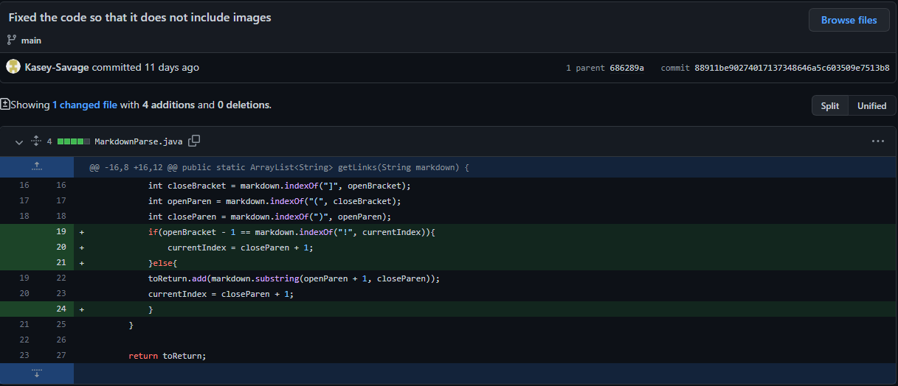
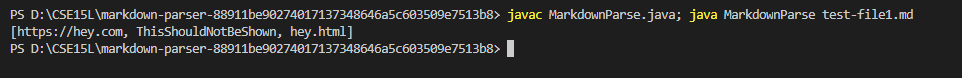
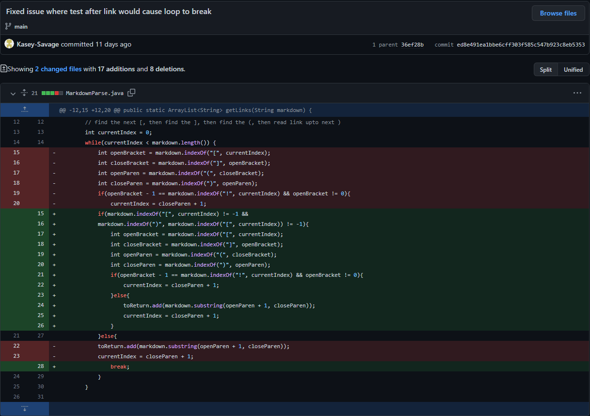
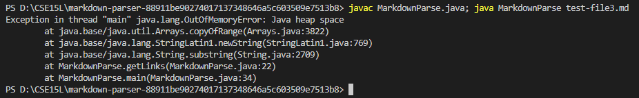
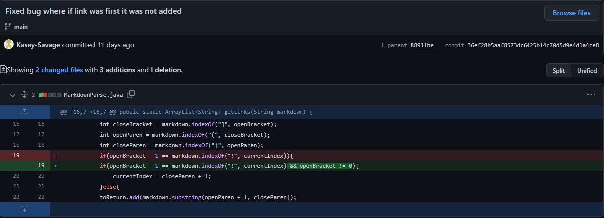
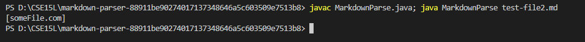

# Bug Fixing from Lab 3

## Code Change 1

[Failure Inducing Input](https://github.com/Kasey-Savage/markdown-parser/blame/main/test-file1.md)

The bug here was that the original code had no way of distinguishing between images and links so it would print both images and links in the output. In the failure inducing input above there are 2 links and 1 image which should have an output of 2 links in the list, however as can be seen, all 3 are put in the list. The failure inducing input led to the bug which then led to the symptom of an incorrect output. 

## Code Change 2

[Failure Inducing Input](https://github.com/Kasey-Savage/markdown-parser/blame/ed8e491ea1bbe6cff303f585c547b923c8eb5353/test-file3.md)

The bug that can be seen now is when text is placed after a link in the file, the program runs infinitely causing it to crash and no output to be produced. In the failure inducing input there is text after a link and as can seen in the output, a failure occurs that crashes the program. The failure inducing input led to the big which then had a symptom of crashing and producing an error instead of the correct output.

## Code Change 3

[Failure Inducing Input](https://github.com/Kasey-Savage/markdown-parser/blame/36ef28b5aaf8573dc6425b14c70d5d9e4d1a4ce8/test-file2.md)

The bug here is that when a link is the very first thing in the file, that link is not printed. In the failure inducing input there are just 2 links which should be simple for the program to do, however the output only contains the second link. This is the symptom of the bug which was uncovered by the failure inducing input.
