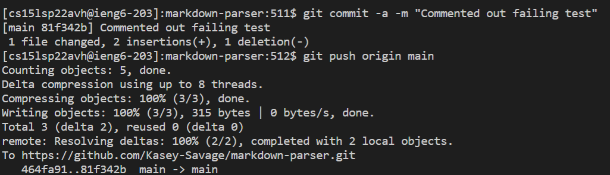

# Group Choice Options from Lab 5

## Streamlining ssh Configuration
> To make and create this file I just opened the .ssh folder in Visual Studio Code and added and edited the config file.


> This is what the new login looks like.


> This is now how scp would look like. As you can see it is much easier.


## Setup Github Access from ieng6
> Public Key on Github:


> Public Key on User Account:


> Private Key is the one above the Public Key in the image above! 

> Now we are able to commit and push changes to Github without any issues:


[Here is the commit on Github](https://github.com/Kasey-Savage/markdown-parser/commit/81f342b2d1f043db4fdb6a2a504d6a42505f7901)

## Copy whole directories with ```scp -r```

> After running the command ```scp -r . ieng6:~``` the output was the following which shows the enitire repsitory copying to ieng6:


> When we go ahead and run it on ieng6 we can see that the tests pass meaning everything was copied over correctly!


> Now after running the command ```scp -r *.java* *.md* lib/ ieng6:markdown-parser; ssh ieng6 "make test"``` the directory is copied over and then run on ieng6. The output would be a combination of both the images above!