# Fixing and Testing Code on Personal and TA Markdown Parser

[My markdown-parser](https://github.com/Kasey-Savage/markdown-parser)

[TA markdown-parser](https://github.com/nidhidhamnani/markdown-parser)

## Snippet 1
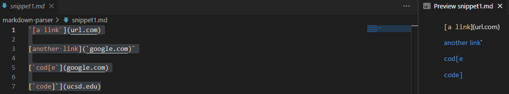

>As per VScode preview the expected output would be; [`google.com, google.com, ucsd.edu].

>Here is the code for the test:

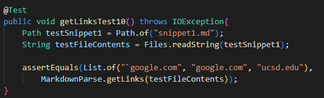

>My implementation did not pass the test when given this markdown file:

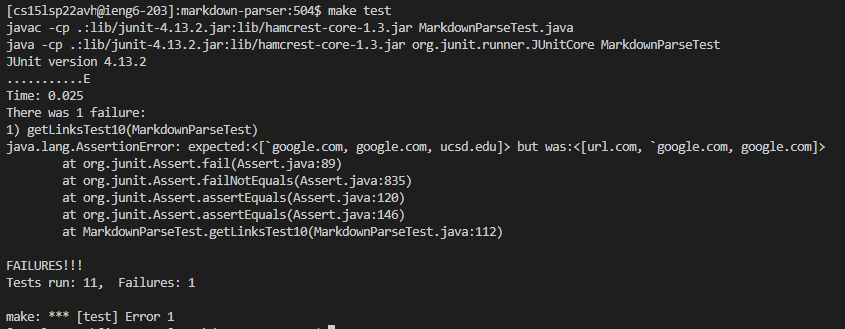

>The TA implementation did not pass the test either:

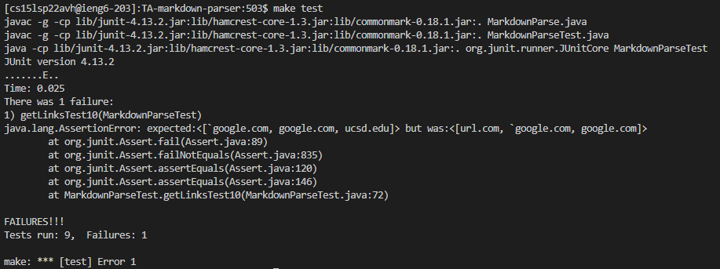

## Snippet 2
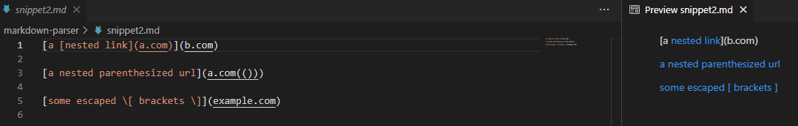

>As per VScode preview the expected output would be; [a.com, a.com(()), example.com].

>Here is the code for the test:

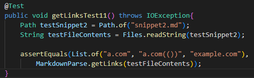

>My implementation did not pass the test when given this markdown file:

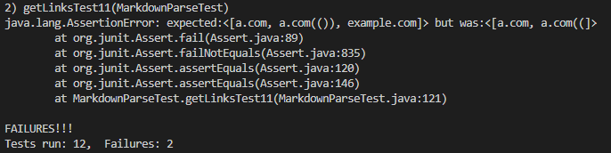

>The TA implementation did not pass the test either:

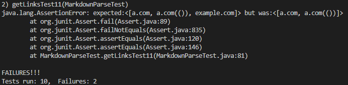

## Snippet 3
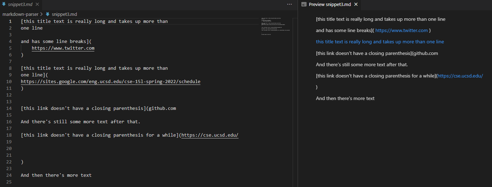

>As per VScode preview the expected output would be; [https://sites.google.com/eng.ucsd.edu/cse-15l-spring-2022/schedule]

>Here is the code for the test:

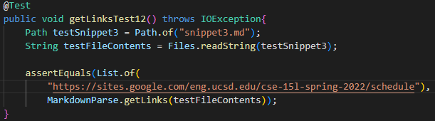

>My implementation did not pass the test when given this markdown file:

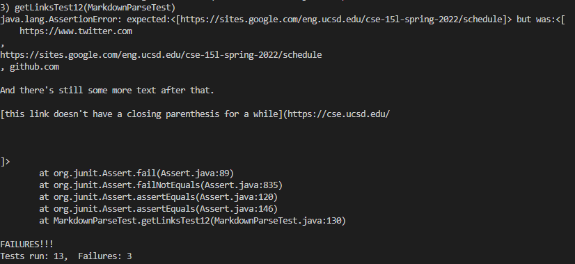

>The TA implementation did not pass the test either:

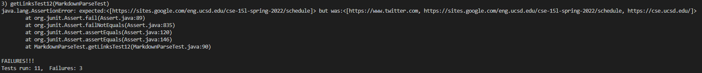

## Can Changes be Made to Make These Tests Pass?

1. I believe that a small change could be made to make it so that snippet 1 passes its test. What I would do is create variables for the frontInline and the endInline. If the frontInline and endInline are contained inside of the brackets and parenthesis then the link would be considered a valid link and would be returned, else the index would jump to the last parenthesis and skip that text that is not a link. 

2. I believe that a change to make snippet 2 pass the test would be a bit more difficult, but making it under 10 lines could be managable. What I would do is have the code look past nested paranthesis to have just the last parenthesis be the one the code is looking at to determine if the content is a link. As well I would do a similar implementation as stated in the segment above when it comes to the slashes. I would create frontSlash and endSlash and just skip past the text that is in between. 

3. I believe that a small change could be made to make it so that snippet 3 passes its test. What I would do is have the method search for empty lines between the brackets and parenthesis and if empty lines are found the method would move on to the next possible link. I am not sure how easy it is to search for empty lines though, so if that is more difficult then the code change might require more than 10 lines. A helper method could definitely help called findEmptyLines, but that might be pushing past 10 lines like I said!
