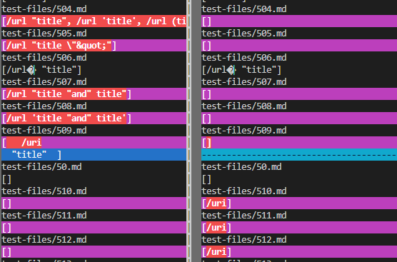
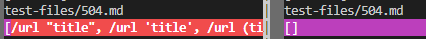
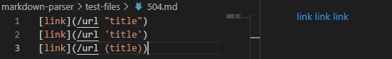
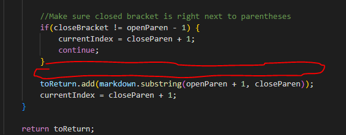
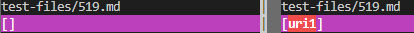
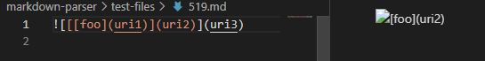
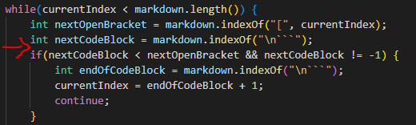

# Testing Markdown-Parser Against Many Many Files

>To view the tests with different results I used `bash script.sh > results.xt` on both my markdown-parser and the markdown parser from lab 9. From there I was able to use `vimdiff markdown-parser/results.txt lab9Markdown-parser/results.txt` which showed me the different outputs of both implementations. This is an example of what the result looked like: 

## Test-File 504

[Link to test file](https://raw.githubusercontent.com/nidhidhamnani/markdown-parser/main/test-files/504.md)

>The implementaion from lab 9  is the correct implementation. 

>The expected output matches the output on the right, which is the lab 9 implementation: []

>Although VS Code preview shows that the output should be 3 links, we can clearly see that none of the "links" are valid links. If clicked on, they would not take the user anywhere. The problem with my implementation is that it does not check if the links inside are actually valid, it just searches for the strucutre of links through the markdown file and returns whatever is inside. To fix this we would just add some code to check the contents of the link once it is found to determine if it is truly a link or not. 

## Test-File 519

[Link to test file](https://raw.githubusercontent.com/nidhidhamnani/markdown-parser/main/test-files/519.md)

>My implementation is the correct implementation. 

>The correct output matches the output on the left, which is my implementation: []

>As can be seen in VS Code preview, the output is an image, so no link should be added to the list. In the lab 9 implementation they should add a check for image links which would just check if "!" is before the first open bracket. This should be done as soon as the open bracket is found and it would just need an if statement to determine if the index of the "!" is one before the open bracket and if so skip over the entire possible link. 

